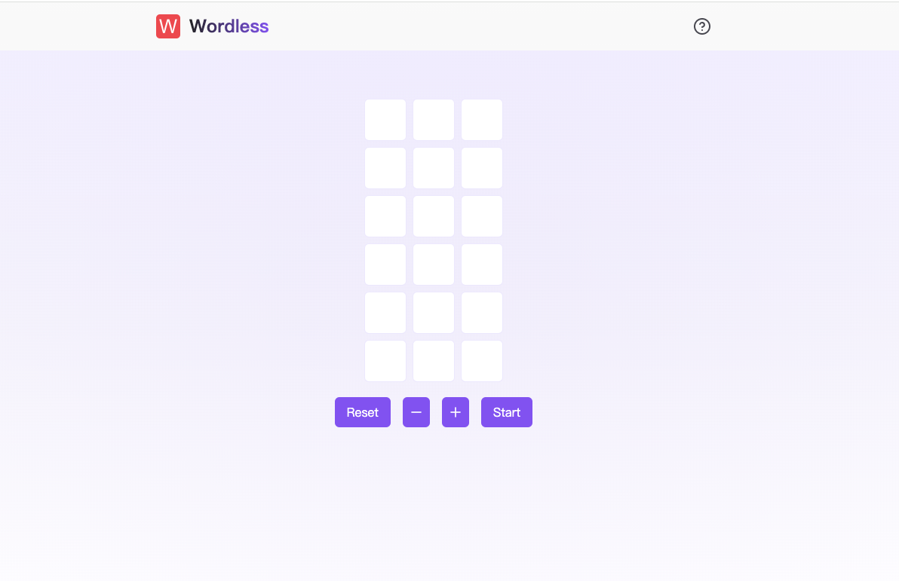
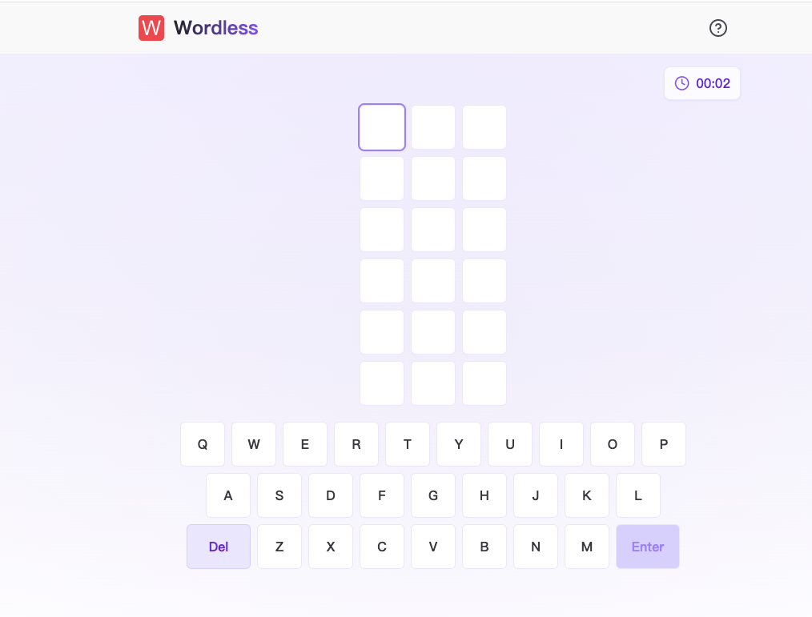
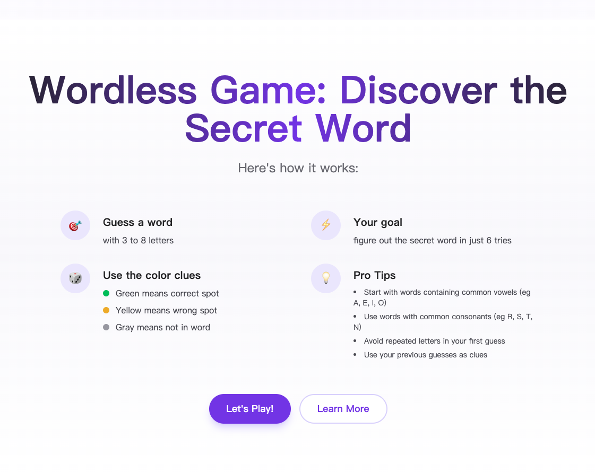
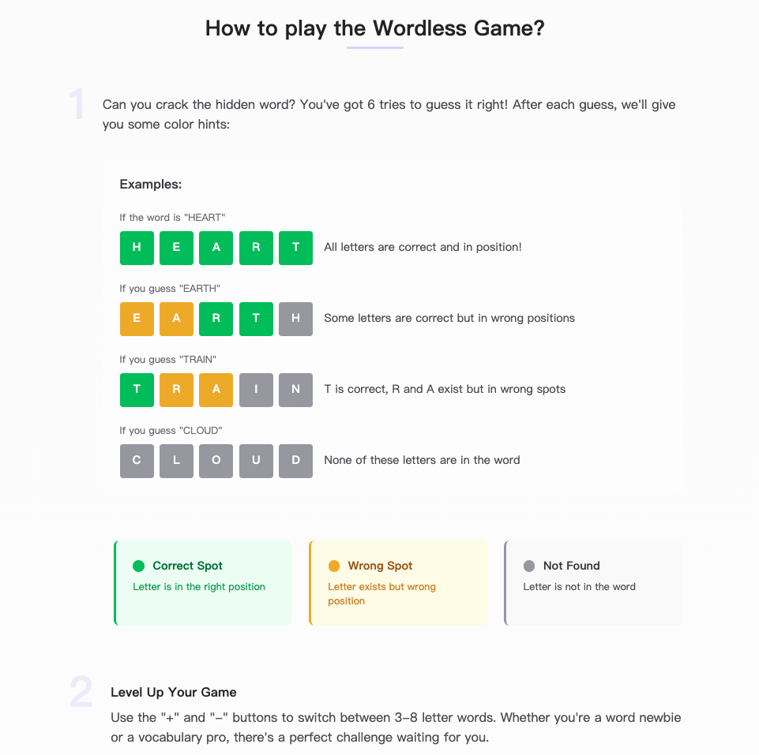

# Wordless Game

## Website
[Wordless](https://wordless.online/)

## Website Screenshots
- Game Area

- Introduction Page

- How to Play

## Game Features

Wordless is an innovative word game designed to stimulate creativity and problem-solving skills through engaging puzzles and challenges. Players must solve puzzles and strategize to complete various tasks within the game.

### How to Play

1. **Start the Game**: Upon entering the game, you will see a simple interface. Click the "Start" button to begin.
2. **Solve Puzzles**: The game presents various puzzles that require observation and thought to solve.
3. **Feedback and Support**: If you encounter any issues or have suggestions, you can contact us through the in-game feedback feature.

## Technology Stack

- **React**: Used for building the user interface.
- **TypeScript**: Provides static type checking for the project.
- **Lucide-react**: Used for icon display.
- **PNPM**: Used for package management.

## Feedback and Support

If you encounter any issues or have suggestions while playing the game, please contact us through the following methods:

- **Support Link**: Click the "let us know" button in the game.

Thank you for your support and interest in the Wordless game!
